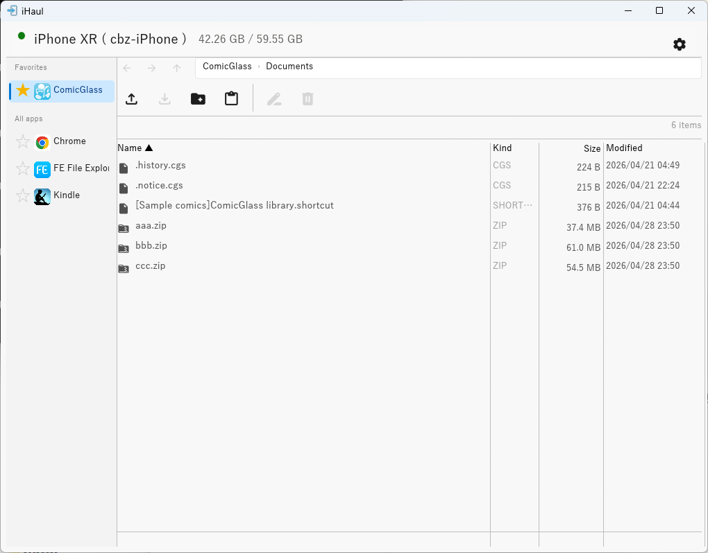
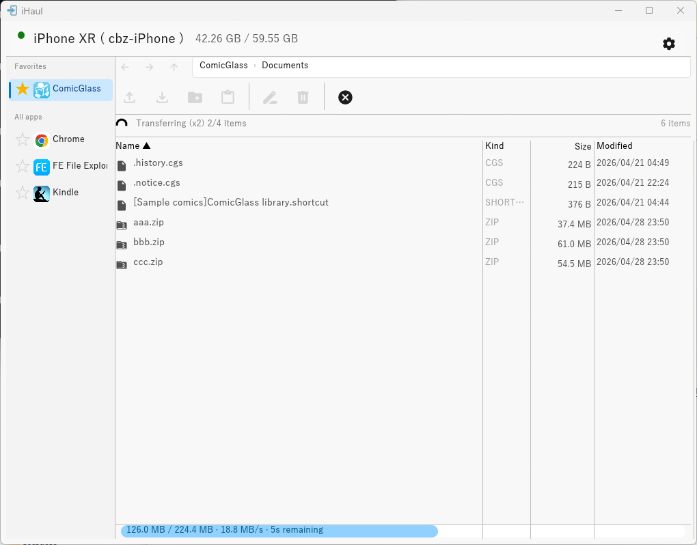

# iHaul

A lightweight iFunBox alternative for Windows, written in Rust.

> I just needed simple file transfer, but iFunBox alternatives were too feature-rich.  
> iHaul does one thing well: transfer files between Windows and iOS — nothing more.

## Features

- **Auto-connect** — detects your device automatically when plugged in via USB
- **File browser** — navigate app Documents folders with an Explorer-style interface
- **Upload** — drag & drop, Ctrl+V paste from Explorer, or file dialog (folders supported via D&D / Ctrl+V)
- **Export** — download files and folders to a local folder (folder structure preserved)
- **Parallel transfers** — transfer multiple files concurrently with speed and progress tracking
- **File operations** — rename, delete (multi-select supported), new folder
- **Favorites** — pin frequently used apps to the top of the sidebar
- **Multilingual** — English, 日本語, 中文
- **No iCloud / no Wi-Fi sync** — transfers over USB only, no Apple account needed

## Download

Download the latest release from [Releases](https://github.com/cbz-tools/ihaul/releases).

| File | Contents |
|---|---|
| `ihaul.exe` | Windows GUI (x64) |

Run it directly — no installation required.

## Screenshots





## Requirements

- Windows 10/11 (x64)
- **iTunes** (installs the Apple Mobile Device USB Driver required for iOS communication)
  - Alternatively: [Apple Devices for Windows](https://apps.microsoft.com/detail/9NP83LWLPZ9K) from the Microsoft Store provides the same drivers
- iOS device trusted on the PC ("Trust This Computer" prompt)
- Target app must have **File Sharing** enabled (`UIFileSharingEnabled = true` in its Info.plist)

## Installation

> **Windows SmartScreen warning**: Because the binary is not code-signed, Windows may show a SmartScreen prompt on first launch. Click **"More info" → "Run anyway"** to proceed.

### Build from source

```
cargo build --release
```

The binary will be at `target\release\ihaul.exe`.

**Prerequisites:**
- Rust toolchain (1.85+)
- MSVC build tools — install [Visual Studio Build Tools](https://visualstudio.microsoft.com/visual-cpp-build-tools/) with the "Desktop development with C++" workload, then run `rustup target add x86_64-pc-windows-msvc`
- NASM (required by the `aws-lc-sys` transitive dependency — add to PATH)

## Usage

1. Connect your iOS device via USB and tap **Trust** on the device if prompted.
2. Launch `ihaul.exe` — the app detects the device automatically within a few seconds.
3. Select an app from the sidebar to browse its Documents folder.
4. Use the toolbar buttons or drag & drop to upload files.

### Keyboard shortcuts

| Key | Action |
|-----|--------|
| Enter | Open folder |
| Alt + ← / Mouse XButton1 | Back |
| Alt + → / Mouse XButton2 | Forward |
| ↑ / ↓ | Move selection |
| Shift + ↑ / ↓ | Extend selection |
| Ctrl+V | Paste files from Explorer clipboard |
| Delete | Delete selected files |
| F2 | Rename selected file |

## Limitations

- Only accesses the `/Documents` folder of each app (iOS sandbox restriction)
- Only apps with `UIFileSharingEnabled = true` are listed
- Jailbreak is **not** required
- Multiple simultaneous devices are not supported (first connected device is used)

## Built With

- [idevice](https://github.com/jkcoxson/idevice) — Pure Rust iOS communication library
- [eframe / egui](https://github.com/emilk/egui) — Immediate-mode GUI
- [tokio](https://tokio.rs) — Async runtime
- [rfd](https://github.com/PolyMeilex/rfd) — Native file dialogs

## License

MIT — see [LICENSE](LICENSE).

This software uses third-party libraries. See [THIRD-PARTY-LICENSES.md](THIRD-PARTY-LICENSES.md) for details.
